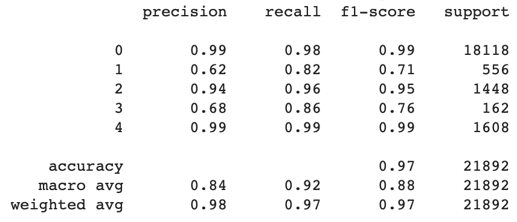

# ECG Heartbeat Classification with Deep Learning

This project applies **deep learning models (1D-CNN + LSTM)** to classify **ECG Heartbeat Signals** into different categories. It also explores **transfer learning** to fine-tune a multi-class for binary classification on a holdout dataset.

---

## **Project Overview**
- **Dataset**: [MIT-BIH Arrhythmia Dataset (via Kaggle)](https://www.kaggle.com/datasets/shayanfazeli/heartbeat)
- **Task**: Multi-class classification (5 heartbeat types)
- **Model**: CNN + LSTM architecture
- **Fine-Tuning**: Transfer learning to adapt to binary classification
- **Tools Used**: Google Colab, TensorFlow/Keras, Scikit-learn, NumPy, Pandas, Matplotlib

---

## **How to Run This Project (Google Colab)**
### **1. Open the Notebook in Google Colab**
- Navigate to the `notebooks/` folder and open **`ECG_Classification.ipynb`**
- The notebook contains **everything from data preprocessing to training and evaluation**

---

### **2. Download the Dataset from Kaggle**
The dataset can be downloaded **directly inside Colab** using the Kaggle API:
- When prompted, upload your `kaggle.json` file to authenticate and download the dataset

---

## **Model Structure & Performance**
### **1. Model Structure**
- The model consists of two **CNN** layers responsible for extracting the features from the ECG signals, followed by an **LSTM** layer to capture the temporal dependencies
- Class weight is added to the model to address class imbalance by giving more weight to the minority class and penalizing more when misclassified
- Learning rate scheduler is added to the call-back to gradually reduce the learning rate while approaching a plateau
- Early stopping is also added to terminate the training once the model starts overfitting or there is no improvement in the training 

---

### **2. Model Performance**
- The model is trained, validated, and tested on the [MIT-BIH Arrhythmia Dataset](https://www.physionet.org/content/mitdb/1.0.0/) to perform multi-class classificationwith with the following performance on the unseen test set:

---

### **3. Transfer Learning**
- I fine-tuned the model above on a holdout dataset ([PTB Diagnostic ECG Database](https://www.physionet.org/content/ptbdb/1.0.0/)), which has two classes, normal and abnormal. To do so, I froze the first CNN and LSTM layers and tune the last Dense layers to perform binary classification
